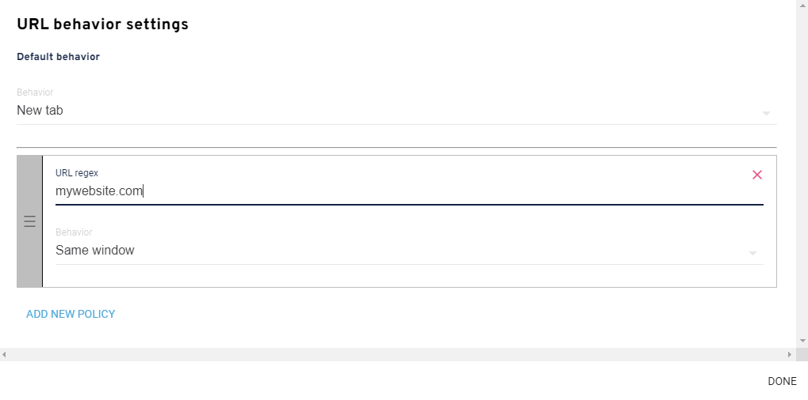

## What is the chat widget channel?

The chat widget is a channel provided by OC Studio that you can customize and embed on your website.  It is built to work alongside other text based input channels with built-in components such as cards, vertical lists, horizontal lists and suggestion chips.  Unique to OC Studio, it also has support for autocomplete suggestions.

You can configure nearly every aspect of the widget, including the styles, without needing a developer and is extensible to allow you to add your own custom components.

## Connecting to a Backend

The chat widget requires a backend for it to communicate with. The widget has two primary modes of communication with a backend, either direct or through a web sockets server. The direct connection is expecting an endpoint that leverages stentor request & response models.

### Connecting to existing Lex Channel

If you have an existing Lex Channel with a PostText URL, you can use this as your chat widgets server.

When you copy and paste the URL, you must post-fix the PostText URL with `/studio` and select "Direct Connection". For example, if you have a PostText URL of:

```
https://kfo7ubarz9t0.execute-api.us-east-1.amazonaws.com/prod
```

Then you want to append `/studio` like so:

```
https://kfo7ubarz9t0.execute-api.us-east-1.amazonaws.com/prod/studio
```

## Installing the Widget

There are two primary way to install the widget on a website; a script tag or through our React based library.  The script tag is quick and can typically be done without a developer and the React library will require a developer to integrate it with an existing web application.  With the script tag method, you are limited to the standard chat button component and widget overlayed on your content and the React library allow gives you much more control on how it is displayed.

### Script Tag

To install the widget with a script tag, go to your chat widget channel within OC Studio and click the puzzle piece icon in the header. Click on the text to copy it to your clipboard.

It will look something like this:

```html
<script
  id="xapp-js"
  src="https://widget.xapp.ai/xapp-chat-widget.js?key=your-unique-key"
></script>
```

The loaded script is self-contained and does not rely on loading of other elements so it can be placed near the bottom of the page to ensure nothing is blocking on load.

Add the copied snippet just inside the `</body>` tag on the site you want the widget to appear on.

:::note
The script itself does not make any blocking network calls and does not depend on any other elements or scripts to load so you can safely place it anywhere. Placing it in right before the `</body>` tag as opposed to within the `<head>` tags provides a slight increase in page load.
:::

:::note
The script is hosted on a CDN however when making configuration updates, the first time loading the widget after a save will be slower than all subsequent calls as the cached scripted is invalidated and the cache updated.  
:::

#### See Also

* [Installing the Widget on Wordpress Sites](widget/install-wordpress.md)

### React Library

It is also possible to embed the widget in a React based web application, this will provide you with a more integrated look and feel however requires you to build and inject your own configuration.

#### Installation

Add to your project:

```bash
npm i @xapp/chat-widget redux-thunk redux react-redux --production
```

```jsx
import { Chat as ChatWidget, WidgetEnv } from "@xapp/chat-widget";
import "@xapp/chat-widget/dist/index.css";

const config: WidgetEnv = {
    connection: {
        serverUrl: "",
        type: "direct"
    },
};

function RenderWidget() {
    return <ChatWidget config={config} mode={"docked"} />;
}
```

The config has all the same parameters configured on the chat widget channel page however without the GUI for setting them.  

When in `docked` mode the widget will fill the space, height & width, given to it and be responsive to changes in dimensions.

## Authenticated Users

For applications where the widget is installed behind a login, you can set the user's unique user ID and access token on the widget so it is passed through to the assistant application.  It can then be used to retreive information specific to the authenticated user.  

The user ID and accessToken will be on every request to your applications runtime.

```typescript

    /**
     * Optional ID that will be used for the user.  If not prevent
     */
    readonly userId?: string;
    /**
     * Optional access token that is passed to the backend and used for authenticated API calls.  This is for logged in users and is passed
     * through on all requests to the assistant backend.
     */
    readonly accessToken?: string;
    /**
     * Optional attributes to append to each request.  
     */
    readonly attributes?: Record<string, string>;
```

There are two primary methods to provide this information to the widget, a global variables on the browser's window object or by a React parameter (requires custom installation method).

### Global Variable on window

You can configure the widget by modifying an object at `window["xaConfig"]`.  The widget will look at this field on bootstraping.  To set the user's ID and access token:

```typescript
window["xaConfig"] = {
    userId: "123",
    accessToken: "abc"
}
```

### React Parameter

If you have installed the widget as part of your React application using the React library, you can append the user ID and access token as part of the configuration.

```jsx
import { Chat as ChatWidget, WidgetEnv } from "@xapp/chat-widget";
import "@xapp/chat-widget/dist/index.css";

const config: WidgetEnv = {
    connection: {
        serverUrl: "",
        type: "direct"
    },
    userId: "abc",
    accessToken: "123",
    // Custom attributes that will be be appended on every request
    attributes: {
        foo: "bar"
    }
};

function RenderWidget() {
    return <ChatWidget config={config} mode={"docked"} />;
}
```

## Configuring the Widget within Studio

If you are leveraging the script tag installation, you can configure the chat widget in OC Studio.  Leverage the split column view with the settings on the left and the widget preview on the right to make changes to parts of the widget and see it updated immediately before saving it.  Saving it will then update the configuration and you can preview it live with the preview link in the header. 

### Share the Widget

The preview link, found in the header of your chat widget channel configuration page, can be used to share the widget externally without requiring a login.  

### Disabling your Widget

You can disable the widget from being displayed after installation or when shared through the preview link by clicking the power button in the header of your chat widget channel configuration page.  


### Behavior of Opening URLs

Hyperlinks will be surfaced from your widget through suggestion chips, list items and within content itself.  You can change the behavior of how they open and even set policies to define how some specific URLs open. 

#### Recommendation - Assisted Navigation

An assisted navigation configuration will open links the widget is installed on in the same tab and others in a new tab.  This will allow the user to ask the widget questions, get answers and navigate to the answer while also keeping the widget open.  



Set the default to be New tab and then add a new policy that contains your website and its TLD and set the behavior to same window.  Any link that matches the URL regex policy will then open in the same window and all those that don't will open in a new tab.


## Modifying the Host Application based on Widget Interactions

During some interactions with the virtual assistant through the widget you may want to change more than just the [URL](/) and modifying specific elements on the page the user is on.  You can achieve this by passing in a hook to the `WidgetEnv` config that is passed to the widget and then leveraging the custom `data` field on the Response sent to the widget.  

### Register the Hook

Add the `hooks` object with the `onResponse` function to your `WidgetEnv` config.

```jsx
import { Chat as ChatWidget, WidgetEnv } from "@xapp/chat-widget";
import "@xapp/chat-widget/dist/index.css";
// This is important
import { Response } from "stentor-models";

const config: WidgetEnv = {
    connection: {
        serverUrl: "",
        type: "direct"
    },
    hooks: {
        onResponse: (response: Response) => {
            console.log('Hook.onResponse');
            console.log(response);
            console.log(response.data);
        }
    }
};

function RenderWidget() {
    return <ChatWidget config={config} mode={"docked"} />;
}
```

### Data on the Response

Within your custom handler, for responses that you want to then pass information to the widget's host application, you can set any metadata on the response using the `.data` field.  The widget will still display the output and display items, the entire response will be sent to the `onResponse` hook and you can then parse the data field.

```typescript
const response = getResponse(this, request, context);

response.data = {
    ["key"]: "123abc",
    ["type"]: "custom request"
};

context.response.respond(response);
```

You can define your own messaging protocol and append the metadata to the data field.