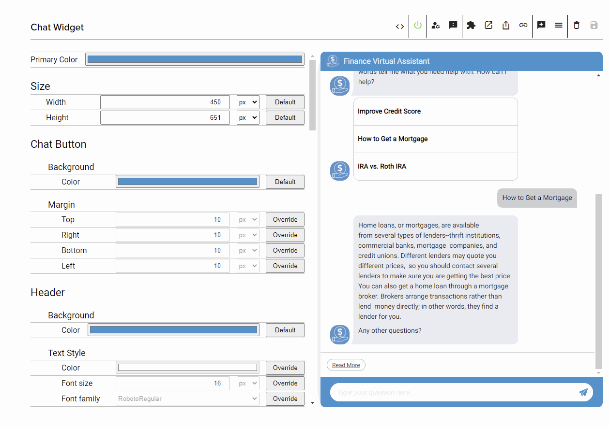
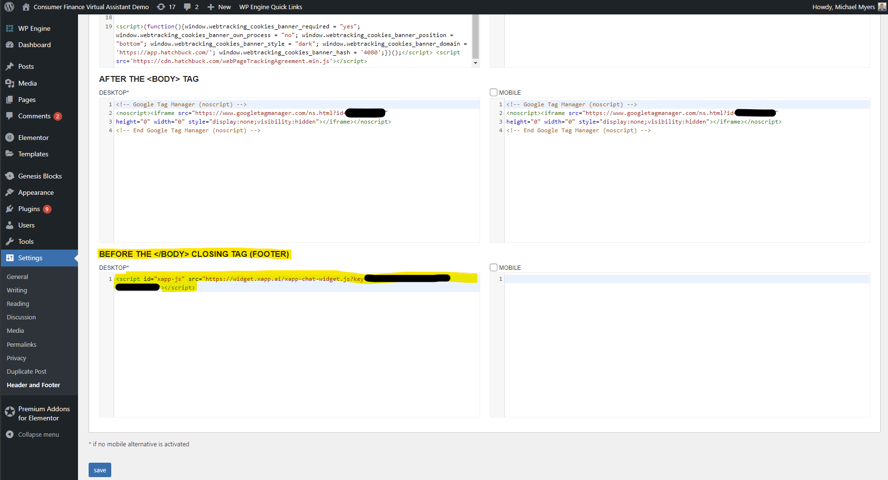

For installation of a chat widget on Wordpress, we recommend leveraging a plugin that allows you to add custom HTML snippets in either the head tag or right before the closing `</body>` tag (sometimes referred to as the footer).  These plugins are typically used for installed third-party scripts like Google Tag Manager.

Potential plugins:

* [Head, Footer and Post Injections](https://wordpress.org/plugins/header-footer/)
* [Header Footer Code Manager](https://wordpress.org/plugins/header-footer-code-manager/)

With the plugin, you can then copy your installation snippet for you widget to the plugin's settings page.

## Finding your Widget's Code Snippet

To find your widget's code snippet, go to the widgets channel page (under Publish --> Channels) and click the puzzle piece icon in the widget's header.

## Installing in Wordpress Plugin

Once the plugin is installed, go to it's settings page and paste the snippet to the section 

The screenshot above is for the [Head, Footer and Post Injections](https://wordpress.org/plugins/header-footer/) plugin.

:::info
While the JS the snippet loads is optimized and hosted on a CDN, we recommend placing it at the bottom of the HTML, before the closing `</body>` tag, to prevent it from blocking any other portions of your website.
:::