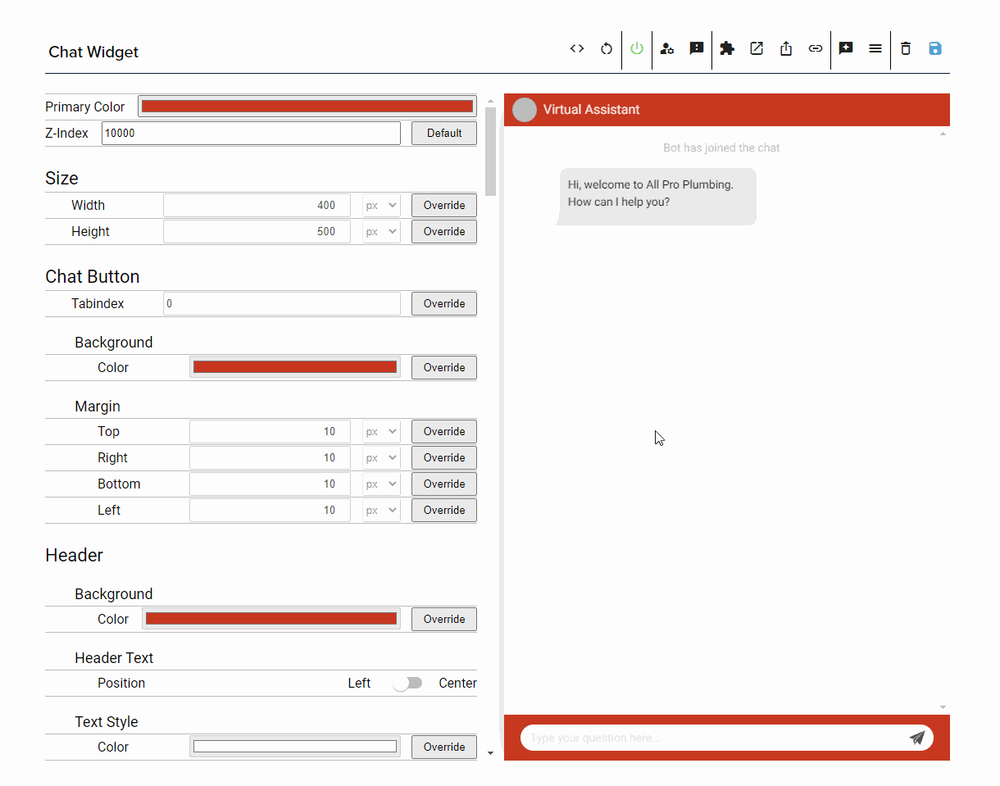

You can use our OC Studio Integration WordPress plugin to quickly install a chat widget and intelligent search widget to your WordPress site.

## Installation

There are two primary methods of installation; through the plugin directory or direct upload.

### Preferred - Installation through Plugin Directory

You can install the plugin from the WordPress Plugin Directory, our listing is [here](https://wordpress.org/plugins/oc-studio-integration/)

1. Within the plugins section of your WordPress admin console, navigate to "Plugins"
1. Click "Add New" at the top left corner next to Plugins
1. In the search bar near the top right corner, search for "OC Studio Integration"
1. In the results, you will see OC Studio Integration by XAPP AI, click "Install" then "Activate"

### Installation through Plugin Upload

Alternatively, you can upload the plugin directly to your WordPress administrative panel.

1.  Download the plugin here: https://assets.xapp.ai/plugins/oc-studio-integration.zip 
1.  Within your WP Admin panel, navigate to "Plugins"
1. Click "Add New" at the top left corner next to Plugins
1.  Click "Upload Plugin" at the top
1.  Select Choose File and select the zip you downloaded in the first step.

## Configuration

Once the plugin is installed, you will notice a new menu item under the Tools menu: "OC Studio Integration".

This menu will allow you to copy and paste either your chat widget or search bar's key.  

You can find the key to copy-paste to the WordPress configuration on the channel's settings page for both chat and intelligent search.

