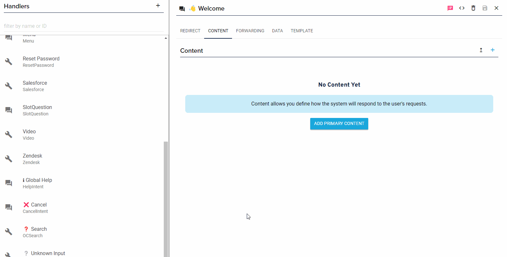

The [handler](/docs/content/handlers) defines a single state of the [dialog manager](/docs/dialog-manager/overview).  The dialog manger will take care of selecting it and instantiating it for you, you just need to focus on the custom logic and integrations within the handler.  

:::important
You must both:
 1. tell the assistant application about the handler 
 2. update the handler type within OC Studio with your class name in order to leverage it.
:::

Example Custom Handler File

```ts
import { AbstractHandler, Context, keyFromRequest, Request } from "stentor";

// 1. Rename to something that describes what the handler does like "SearchHandler"
export class CustomHandler extends AbstractHandler {

    // 2. Define which requests the handler can handle
    public canHandleRequest(request: Request, context: Context): boolean {

        const key = keyFromRequest(request);

        const handled: string[] = ["HelpIntent"];

        if (handled.includes(key)) {
            return true;
        }

        return super.canHandleRequest(request, context);
    }

    // The handleRequest is called 
    public async handleRequest(request: Request, context: Context): Promise<void> {
        // 3. Write your custom logic
        const key = keyFromRequest(request);

        switch (key) {
            case this.intentId:
                // Kick off the flow
                context.response.say('Hello world!')
                    .reprompt("The reprompt is used on voice channels when the user doesn't respond.")
                    .withCard({
                        type: "CARD",
                        title: "Card",
                        content: "This is an example of a card"
                    });
                // Exit from the flow
                return;
            case 'HelpIntent':
                // Provide contextual help 
                context.response.say('This is handler specific help that is returned.');
                // Exit from the flow
                return;
            default:
            // Let it fall through to the super
            // 👇
        }

        // 4. Let remaining requests fall through to the super
        //    It is not recommended to remove this
        return super.handleRequest(request, context);
    }
}
```

You then must register the custom handler with the dialog manager in the application builder:

```ts
export const handler = new Assistant()
    .withHandlers({
        CustomHandler
    })
    .withChannels([Alexa(), Dialogflow()])
    .lambda();
```

:::important
If you are using a minifier that changes the class names then instead of using the shorthand notation when the key and value are the same like in the above example, you must use the longer `CustomHandler: CustomerHandler` 

```ts
    .withHandlers({
        CustomHandler: CustomHandler
    })
```
:::

Once you have registered it with the application, you must set the type in Studio for the handlers that will use it. 




## Redirects and Forwards

In addition to defining the content that is returned, you can also programmatically control [redirect and forwarding](/docs/content/handlers#redirects--forwards) paths.

Add the either or both of the following to your custom handler.

```ts
    public async redirectingPathForRequest(request: Request, context: Context<Storage>): Promise<ExecutablePath> {

        if (true /* replace with your logic to dermine need to redirect */) {
            return {
                type: "START",
                intentId: "NewIntentId"
            };
        }

        return super.redirectingPathForRequest(request, context);
    }

    public async forwardingPathForRequest(request: Request, context: Context<Storage>): Promise<ExecutablePath> {
        if (true /* replace with your logic to dermine need to forward */) {
            return {
                type: "START",
                intentId: "NewIntentId"
            };
        }

        return super.forwardingPathForRequest(request, context);
    }
```

If you need to redirect or forward, return an object, of type ExecutablePath, that contains the ID (`intentId`) of the handler you will be forwarding to.  You could potentially just return `undefined` if you are not changing handlers however there is benefit in calling the super methods.  If you fall through to the supers then you can also define the behavior inside OC Studio's GUI, which gives you more flexibility to modify the behavior without development.