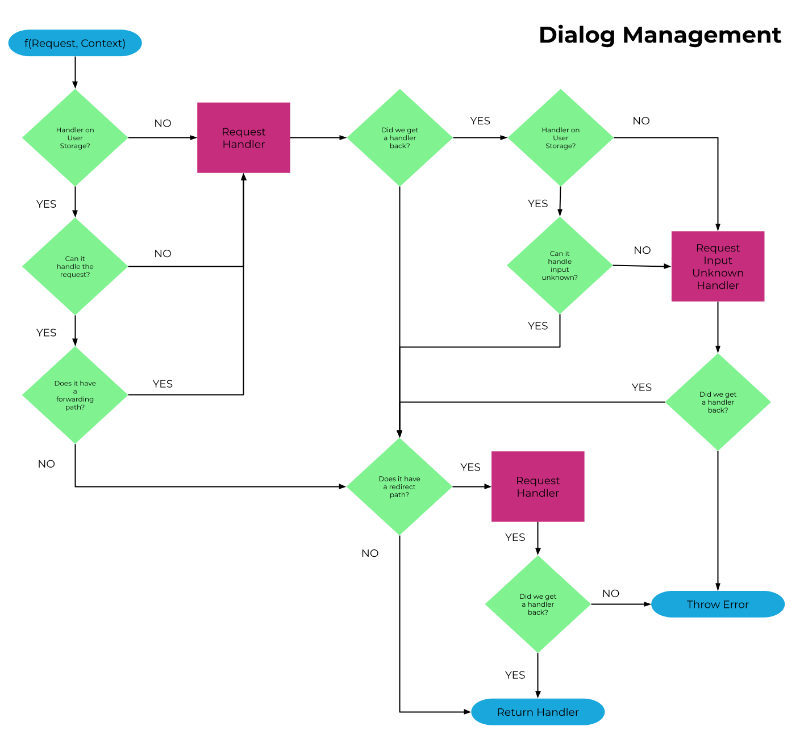

## What is a dialog manager?

A dialog manager is essentially a custom tailored state machine for handling conversations. It takes input from users in the form on an intent and then depending on the current state, defined logic, and historical and current context will then determine the correct response

## OC Studio's Dialog Manager

OC Studio leverages the open source project stentor for it's runtime that has a dialog manager built-in.

The handlers, which define a state for the dialog manger, contain the logic and contain for handling requests and returning responses. The user can be passed around to different handlers through the user of redirects and forwards. Intents and handlers are decoupled meaning they can be used independently from each other with a focus on the ability to reuse intents based on different contexts.

## Runtime

For each incoming request, while taking into account the context, the dialog manager performs the following workflow to determine which handler will receive the request.

First, the dialog manager checks the user storage for an existing handler, which will exist for returning users. If it exists it will check to see if the handler can handle the incoming request in some way. If it doesn't exist then it will request the handler from the content management system. If the CMS does not have a handler defined for the request, it will then request the required global Input Unknown handler to help the user return to a defined flow.
