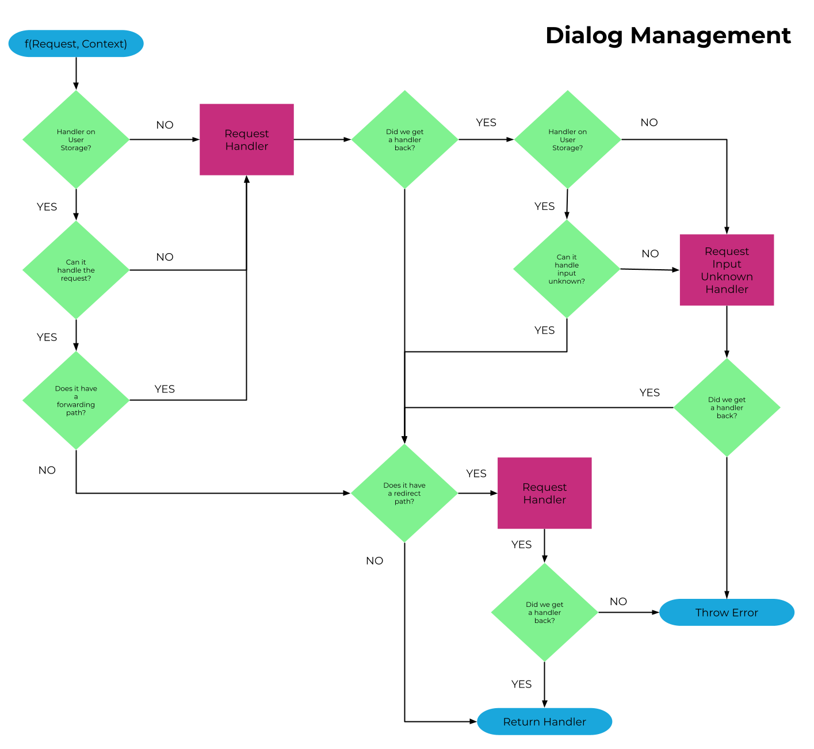

import { ChatMessageBubble } from "@xapp/chat-widget-components";

## What is a dialog manager?

A dialog manager is essentially a custom tailored state machine for handling conversations. It takes input from users in the form on an intent and then depending on the current state, defined logic, and historical and current context will then determine the correct response

## OC Studio's Dialog Manager

OC Studio leverages the open source project stentor for it's runtime that has a dialog manager built-in.

The handlers, which define a state for the dialog manger, contain the logic and contain for handling requests and returning responses. The user can be passed around to different handlers through the user of redirects and forwards. Intents and handlers are decoupled meaning they can be used independently from each other with a focus on the ability to reuse intents based on different contexts.

## Runtime

For each incoming request, while taking into account the context, the dialog manager performs the following workflow to determine which handler will receive the request.

First, the dialog manager checks the user storage for an existing handler, which will exist for returning users. If it exists it will check to see if the handler can handle the incoming request in some way. If it doesn't exist then it will request the handler from the content management system (CMS). If the CMS does not have a handler defined for the request, it will then request the required global Input Unknown handler to help the user return to a defined flow.

## Examples

Let's try to simplify this by reviewing a couple of examples and personifying the dialog manager (green) and handler (grey).

**Middle of a flow, like product search**

<ChatMessageBubble owner="mine" hasTail>
  Handler, we have an incoming request, it has product information, can you handle it?
</ChatMessageBubble>
 

<ChatMessageBubble owner="others" hasTail>
  Let me check... sure looks like I can handle it.
</ChatMessageBubble>
 

<ChatMessageBubble owner="mine" hasTail>
  Ok, here is the request, handle it.
</ChatMessageBubble>
 

<ChatMessageBubble owner="others" hasTail>
  Thanks, you should respond with this: "I can help you find that! What's your zip code?"
</ChatMessageBubble>
 

<ChatMessageBubble owner="mine" hasTail>
  Will do.
</ChatMessageBubble>
 

**Middle of a flow, unknown or unexpected input**

<ChatMessageBubble owner="mine" hasTail>
  Handler, we have another incoming request, this looks like a request for a type of drink, can you handle it? 
</ChatMessageBubble>
 

<ChatMessageBubble owner="others" hasTail>
  I'm the password reset handler, so definately not.
</ChatMessageBubble>
 

<ChatMessageBubble owner="mine" hasTail>
  No problem, let me see if there is something in the CMS that can take it.  Hold on a second.
  ...
  Ok, CMS had no idea.  How about unknown inputs, can you handle that?  
 </ChatMessageBubble>
 

<ChatMessageBubble owner="others" hasTail>
  I can actually!  Respond with this: "I might not have heard you correctly, what is your email? It should look something like email@domain.com"
</ChatMessageBubble>
 

<ChatMessageBubble owner="mine" hasTail>
  Passing it on.
</ChatMessageBubble>

 

In the above, the handler could not handle the incoming request so the dialog manager then attempted to see if the CMS had anything for it.  If it did, the handler would be retrieved and used however in the above case it did not.  The dialog manager then checked the handler again to see if it had a response for an unexpected input, which it did.  It is useful to define specific responses for this situation in a flow to help the user get back on track.