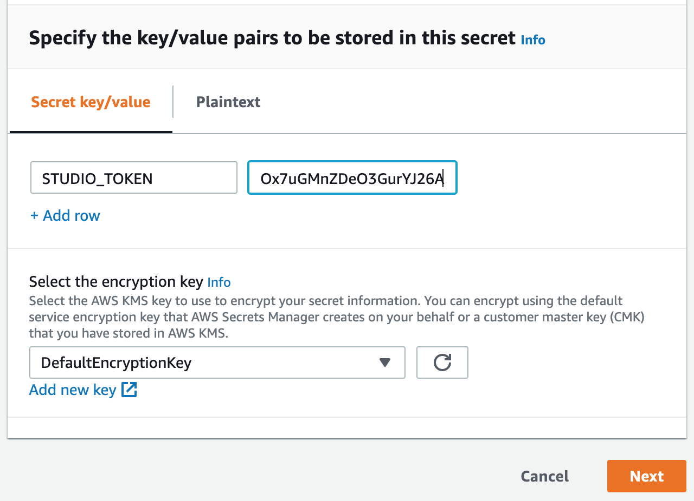

Before you can deploy your application stack, you must first create a Secret in [AWS Secrets Manager](https://aws.amazon.com/compliance/services-in-scope/).

Secrets Manager allows you to securely store secrets, such as API tokens, in one central location.

This secret will secure the creation of the stack and secures the communication with your application stack and OC Studio during runtime.

1. Within the AWS Console, navigate to the Secrets Manager and click "Store a new Secret". Or click [here](https://console.aws.amazon.com/secretsmanager/home?region=us-east-1#/newSecret?step=selectSecret)

2. On secret type, select "Other type of secrets"

3. You will now set a key/value pair with the token. For the key you must use `STUDIO_TOKEN` and for the value, paste the token you copied from OC Studio.

4. Leave the encryption key as DefaultEncryptionKey and select Next

5. On the next page, for the secret name use `OCStudio`. Add the optional description and tags for reference. Click Next.

6. On the Configure Rotation page, you can leave all of the default values. We will not automatically rotate this key, rotation will be manual. Click Next.

7. Review the secret. Ensure the secret name is `OCStudio`. Finalize by clicking Store.
