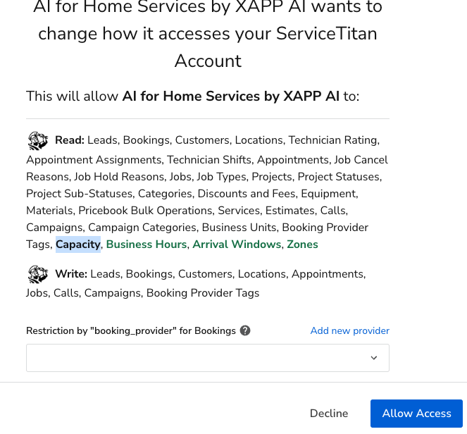

You can connect your existing Service Titan account with AI Powered Chat, and Google Business Messages.

- Send bookings to your Service Titan account
- Collect name and contact information
- Naturally transition the conversation to a lead flow
- Receive the full transcript of the conversation
- Get notified when users are talking to you, and speak directly
---

## Connect your Service Titan account to XAPP AI

### Step 1
#### Provide your tenant id from your Service Titan account  
- You can find this by going to 'Integrations -> API Application Access' from your account.
- Enter this value when XAPP AI prompts for it
  

 

 

### Step 2
#### Connect to XAPP Bookings
- From the same page on your Service Titan account, click the **Connect New App** button app 
  

 

- Select the app, choose 'XAPP Bookings'

 
 
 - Allow Access to connect your account

 

#### Make sure you add a Booking provider

- Adding a provider will allow you to see where your booking are coming from
- If you haven't done this, add it by clicking 'Add new provider' and repeating Step 2 when you've add it.  Your new booking provider will show in the drop-down when selecting.  * make note of the ID associated with the booking, you'll need it later*
  
   

    

### Step 3
#### Share your Client ID and Client Secret

 - After successfully connecting your account, Service Titan will provide a **ClientID** and **Client Secret**
 - Make sure you generate the Client Secret and copy it to share later

 

  

 

### View Bookings on your account

- To Trigger a lead, type **Contact Us** in your Chat or Google Business Message app.  You'll be prompted for your contact information.   
- In your Service Titan account, leads will be sent to **Calls->Booking** in your account
- View each lead, and accept or dismiss

