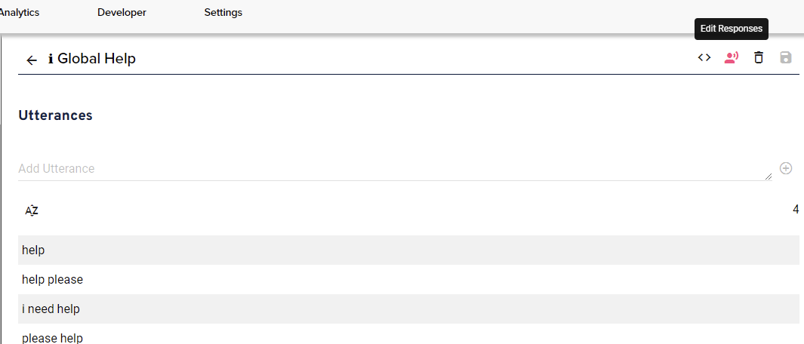

import { ChatMessageBubble } from "@xapp/chat-widget-components";

## What is an intent?

An intent is a set of utterances that a user may say that all describe a single action. It is a fundamental component of natural language understanding. In the context of conversational AI, one you have what the user has typed in or spoken in text form, it is then classified into a specific intent. For example "yes" and "sure" have the same meaning and can be part of an named `Yes` or `AffirmativeConfirmation`.

| Intent         | Sample Values                                                                |
| -------------- | ---------------------------------------------------------------------------- |
| Product Search | <p> "i'm looking for diet cola" <br/> "where can i find sugar free pop" </p> |
| Order Coffee   | <p> "may i have a small french roast" <br /> "large americano please" </p>   |
| Filter by Date | <p> "only look last month" <br /> "within the next couple of days" </p>      |

## Built Ins

Some natural language understanding (NLU) services like Amazon Lex & Microsoft Luis provide general usage built in intents that have predefined values.

| Built In | Sample Values                 |
| -------- | ----------------------------- |
| Cancel   | "cancel", "cancel please"     |
| Back     | "go back", "return"           |
| Yes      | "yes", "yes please            |
| Agent    | "agent", "real person please" |

**References**

- [Microsoft Luis Prebuilt Intents](https://docs.microsoft.com/en-us/azure/cognitive-services/luis/howto-add-prebuilt-models#add-a-prebuilt-intent)
- [Amazon Lex](https://docs.aws.amazon.com/lex/latest/dg/howitworks-builtins-intents.html)

## Special Intents

Another feature of NLU services are special (or pseudo) intents that do not necessarily match with an utterance. A common special intent it the `Input Unknown` or `No Match` intents that is used when a natural language input cannot be matched with a set of known intents. Other special intents can be channel specific, such as the [`AMAZON.KendraSearchIntent`](https://docs.aws.amazon.com/lex/latest/dg/built-in-intent-kendra-search.html) which uses the natural language input to search an Amazon Kendra index.

## Utterance Expansion Notation

Utterance expansion notation allows you to more efficiently build out the sample utterances of your intent.  You can quickly account for variations in carrier phrases, contractions, and other optional words like "please" or "ok".

To elaborate, Alexa [recommends](https://developer.amazon.com/en-US/docs/alexa/custom-skills/best-practices-for-sample-utterances-and-custom-slot-type-values.html#sample-utterance-phrasing) you think about all the possible variations of a sample utterance and add them to your intent.  In their example for a horoscope skill, they suggest you add a sample of "what's" to account for "what is".   This means you need to go from one sample utterance:

<ChatMessageBubble owner="mine" hasTail>
what is the horoscope
</ChatMessageBubble>
<br />
to two: 

<ChatMessageBubble owner="mine" hasTail>
what is the horoscope
</ChatMessageBubble>
<br />
<ChatMessageBubble owner="mine" hasTail>
what's the horoscope
</ChatMessageBubble>
<br />

The only difference in these two utterances is the first part, while the rest is the same.  You can leverage this pattern by using expansion notation:
```
{what is|what's} the horoscope
```
The sample is expanded into the above examples.  The expansion notation is bookended with `{` and `}` while each expansion is then separated by `|`. 

## Contexts

On intents, you can set input contexts.  These help the NLU know which intent to expect from the user based on what you asked them.

For example, you are asking the user for the zip code.  Most likely, any number they then respond with should go to the intent that captures zip codes so you let the NLU you are expecting a zip code.  Then, when the NLU analyzes the user's next query it will know to prefer the intent that captures zip code.

These input contexts can be extremely helpful in disambiguating potential queries from the user can potentially match to multiple intents.  A persons first name may also be the name of a city, a number may either be a phone number or a zip code.  Setting the input context alleviates these issues.

:::important
NLUs will treat input context slightly different.  Google Cloud Dialogflow ES for example will use it to prefer certain intents but they will always be available however on Amazon Lex intents with context will only be returned if you tell the NLU to expect it.
:::

### How to Set the Input Context

First, on the intent you set an input context.  The name of the context must only contain letters and underscores.  We recommend prefixing with `expecting_` and then the type of information you are gathering.  For example:

```
expecting_name
```

```
expecting_email
```
You will find the contexts at the bottom of the intent configuration view.


In the above intent, the input context of `expecting_address` is set.

Then, within a handler's content on your response that asks the user for their address.


Click the `+` button next to the "Add Reprompt" button and select "Active Contexts".  Make sure this matches exactly with what you added to the intent.

## Classification of Intents 

The intents you define will typically fall into a couple of primary buckets.

### Global

Global intents typically mean one thing regardless of where somebody is within the assistant application.  They then typically always stop what the user is doing and they then start a new task.  For example, "i want to reset my password" will always kick off some kind of reset password flow, regardless of what the user is currently doing.  You can always choose to override this behavior at the handler level but for the most part these type of intents kick off specific flows.

Examples:

* "reset password"
* "check my account balance"
* "order replacement card"

#### Cancel & Help 

The built-in cancel & help intents are typically considered global but best practice here, especially on the help intent, is to provide contextual help.  

### Fallbacks

Fallbacks all called whenever something is said that is not defined anywhere in your interaction model or when a confidence threshold is not met.  These are your pseudo intents like InputUnknown and OCSearch.  Similar to Cancel & Help, you will need a global response to these however you should also override the response at the handler level.  If you asked the user a question and you then receive a fallback intent, you should better clarify to the user exactly what you are looking for in a contextual response, keeping them in the current flow.

### Information Gathering

These are for gathering information from the user.  They are reusable and do not have flows assigned to them, instead the response is contextual based on where the user is within a flow.  

Examples:

* "my zip code is 123456"
* "next wednesday"
* "yes"

These have high reuse value.  

## Relationship with Handlers

A simple analogy is to understand the relationship between intents and handlers is intents are the input and handlers are the output.  For global intents, ones the typically kick off new flows, they have content associated with them, meaning if you click "Edit Responses" on the intent page, it will take you to it's associated handler.  Furthermore, you will see a handler with the exact same name and ID in the handlers list.

On the intent, if it is global you will see an icon with helper text: "Edit Response"



Clicking on this button will take you to the handler for the intent where you will see "Edit Utterances"

