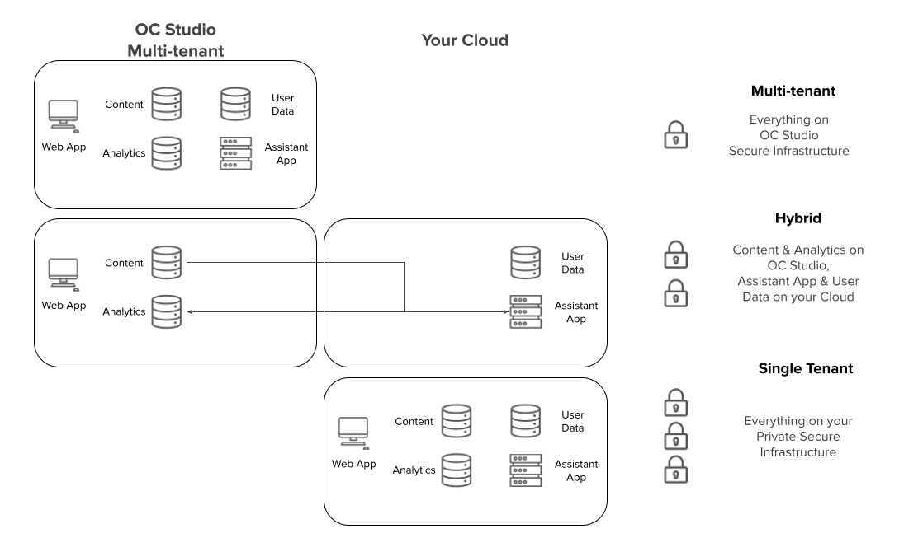
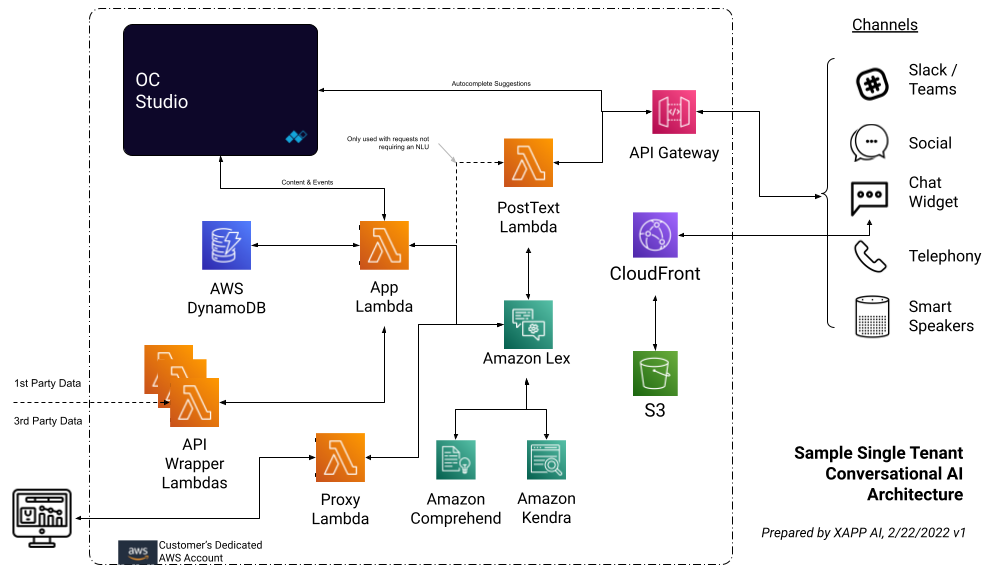

OC Studio supports three primary architectures for building, hosting, and maintaining your conversational virtual assistant.  Each architecture provides different levels of customization, data security requirements, and cost.

## Multi-tenant

Our multi-tenant allows you to build and run relatively simple assistants and also mock out more complex designs.  Everything runs on our robust shared infrastructure with other tenants.  Data is logically separated and the runtime environment is managed by XAPP AI.

## Hybrid

The hybrid architecture allows you to host the assistant's runtime environment on your infrastructure, providing customization and absolute control over what data you send to the multi-tenant OC Studio environment.  This is a cost effective way to achieve certain more strict data security requirements.

## Single Tenant

Single tenancy allows you the most customization and also ensures all of your data stays on infrastructure you own and control.

### Single Tenancy on AWS

