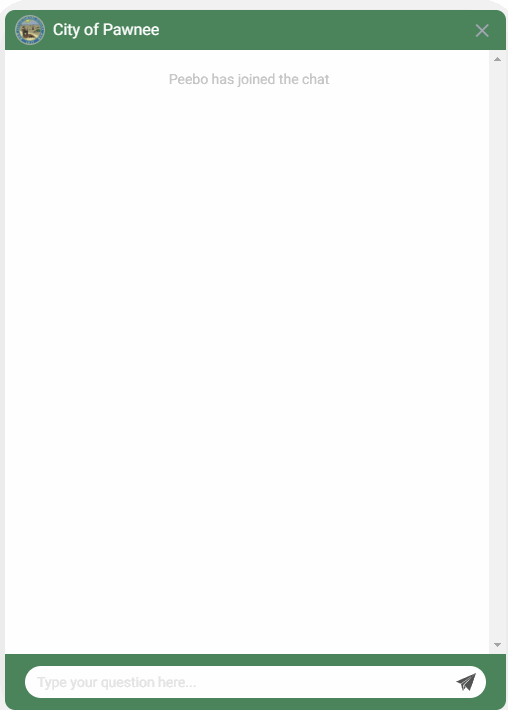
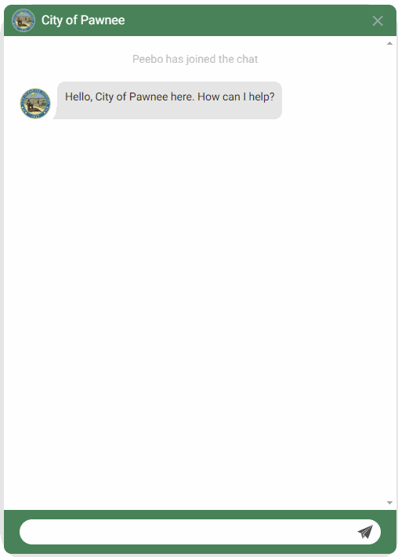

Autocomplete suggestions provide helpful hints at what your user can type on certain channels such as the chat and search.

## How they work

The autocomplete suggestions are powered by three sources:

* __Model__ - All of the sample utterances from your intents and values from your entities are used to provide suggestions.
* __FAQs__ - The questions for you defined FAQs are surfaced as well and have the ability to provide instant answers.
* __Historical__ - Based on past usage, queries that have been marked as correct will appear in the 

### Weighting & Conflicts

To accurately surface the most appropriate suggestion and help avoid conflicts between the different sources, we weight the sources in the following priority order:

* __Historical__ - Previous user queries that have been reviewed have the highest priority
* __FAQs__ - The curated list of questions for the FAQs has a slight preference over model based suggestions
* __Model__ - The interaction model is typically the largest source and most broad

## Instant Answers

For relevant FAQs that are surfaced in the suggestions, the answer will appear when the user hovers on the FAQ as if they were about to click on it.

This can save the user a click or they can click through to get additional information associated with the answer such as the web source for clicking through.