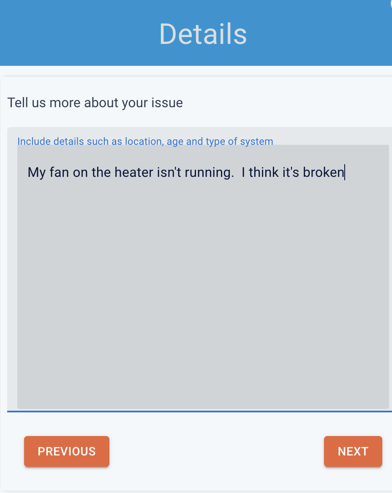

:::important

- 3rd party integrations are available starting at the Leads+ tier
- You must be on Housecall Pro's [MAX plan](https://www.housecallpro.com/pricing/) to integrate leads, and scheduling requests

:::

You can connect your existing Housecall Pro account with AI Chat, AI Scheduling, and Google Business Messages.

- Send user requests to your Housecall Pro account
- Collect contact information, and scheduling requests
- Naturally transition the conversation to a lead flow
- Receive the full transcript of the conversation
- Get notified when users are talking to you, and speak directly

---

### Connect your Housecall Pro account to XAPP AI

Allow XAPP AI access to your Housecall Pro instance, we'll manage customer requests, locations, scheduling, and notes on your account.

#### Step 1. Navigate to the App Store (top right on your Housecall Pro account)

#### Step 2. Select the API app from your Housecall Pro Max plan

#### Step 3. Generate a new API Key and grant full access

#### Step 4. Generate a new API Key and grant full access

#### Step 5. Copy & Share your API Key

### Chat & Google Business Messages

_Detect that the user wants to connect with the business_

We provide helpful suggestion chips users can click to initiate a lead flow. This can be a simple 'Contact Us' button like above.

Also provided are pre-built language models to determine a user's desire to connect with the business. When this happens, the user is put into a lead flow. In the image above, our auto-complete suggestions for a home services company lets the user discover the phrases they can use.

### Lead information sent to your Housecall Pro account

When a lead is captured during a chat or Google Business Messages session, XAPP AI sends the following information:

- Customer - View all the collected information from a Chat, or Google Business Messages session. The transcript will be attached as a note.

### Scheduling Information sent to your Housecall Pro account

Our AI Scheduler will collect more than just lead information. Send jobs directly to your account with helpful AI powered summaries based on the user's description of the issue. Use this information to prioritize the highest ticket scheduling requests first.

#### Scheduling user requests in 3 steps!

1. Collect Contact info

2. Describe your issue 

3. Select your preferred day 

4. Done! 
   

- [Wordpress Plugin Installs Chat, Search & Scheduling](/help/install/wordpress)
- [Install Manually](/help/install/javascript)
