:::important

3rd party integrations are available on all paid tiers, it is not available on Starter.

:::

You can connect your existing Jobber account with AI Powered Chat, and Google Business Messages.

- Send user requests to your Jobber account
- Collect name and contact information
- Schedule jobs
- Naturally transition the conversation to a lead flow
- Receive the full transcript of the conversation
- Get notified when users are talking to you, and speak directly

---

### Connect your Jobber account to XAPP AI

Allow XAPP AI access to your Jobber instance, we'll send captured leads as 'Requests' to your account

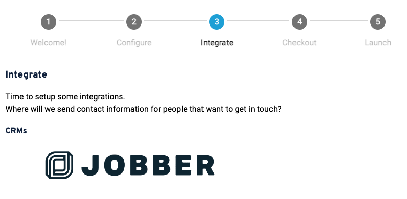
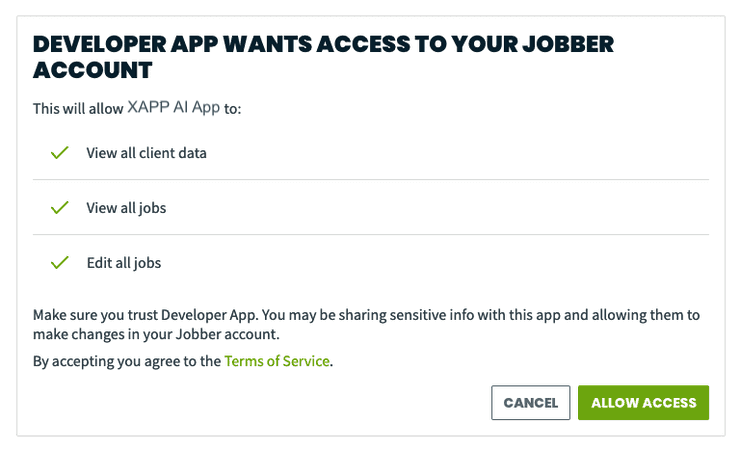
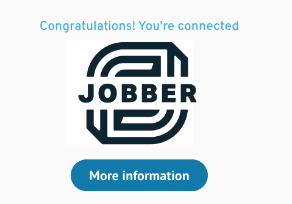

### Detect that the user wants to connect with the business

We provide helpful suggestion chips users can click to initiate a lead flow. This can be a simple 'Contact Us' button like above.

Also provided are pre-built language models to determine a user's desire to connect with the business. When this happens, the user is put into a lead flow. In the image above, our auto-complete suggestions for a home services company lets the user discover the phrases they can use.

Helpful components to collect the address and date are available to improve the user experience.

### Lead information sent to your Jobber account

When a lead is captured during a chat or Google Business Messages session, XAPP AI sends the following information:

- Request - View all the collected information from a Chat, or Google Business Messages session. The transcript will be attached as a note.
- Request Details - you'll receive the source of the Lead, The user's address, and contact information.
- Client - The lead will exist as a 'Client' in the system.

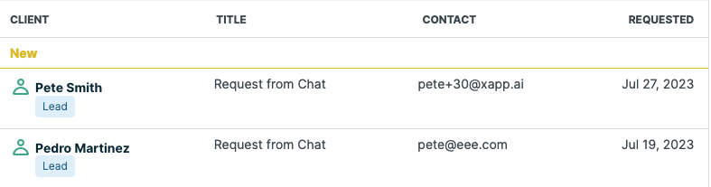

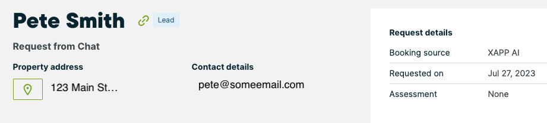

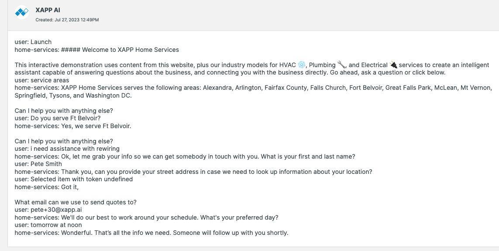

### Scheduling Information sent to your Jobber Account

Our AI Scheduler will collect more than just lead information.  Send jobs directly to your account with helpful AI powered summaries of the type of job.  Use this information to prioritize the highest ticket scheduling requests first.  

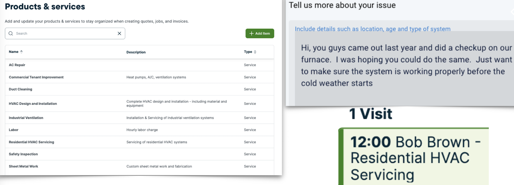

*Quickly prioritize the highest ticket jobs, automatically labeled with your existing products and services*

#### Scheduling user requests in 3 steps!

1. Collect Contact info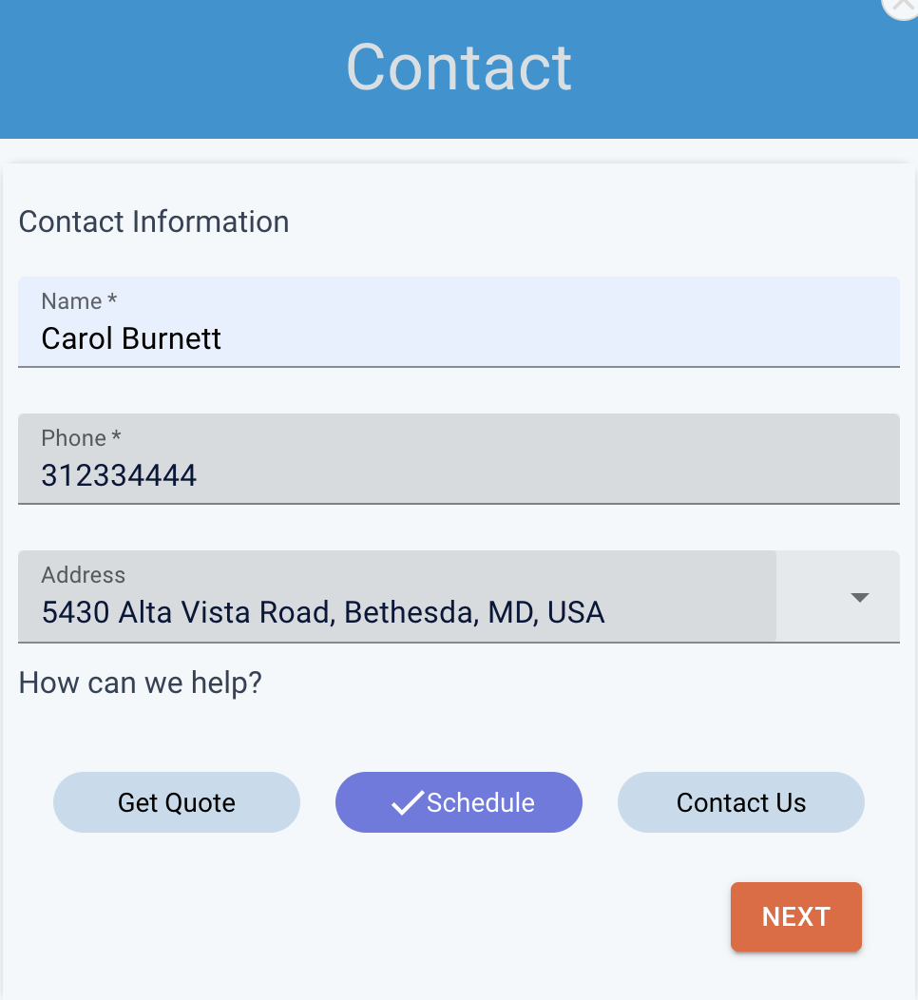

2. Describe your issue 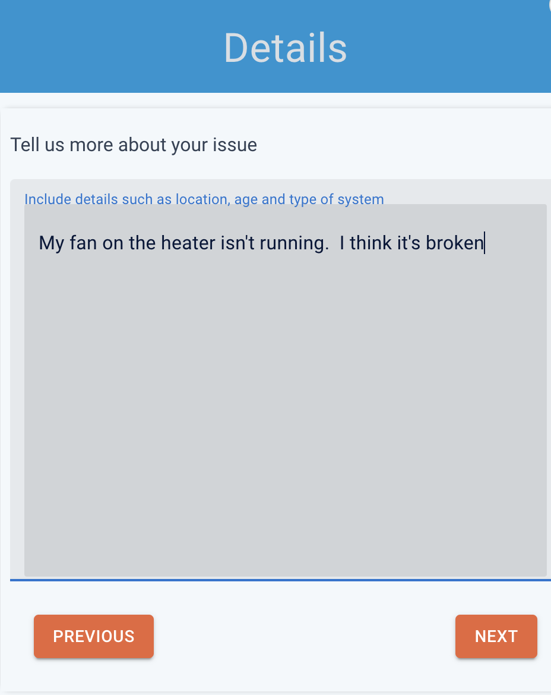

3. Select your preferred day 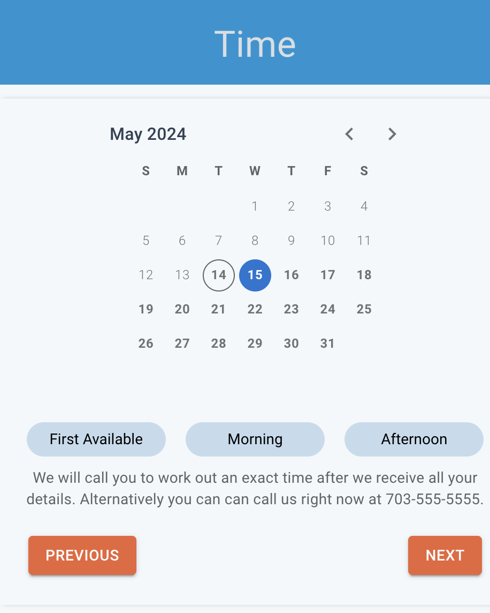

4.  Done! 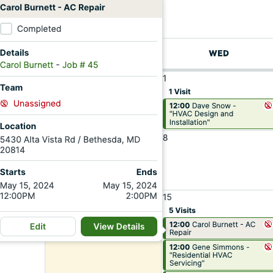

### Install Chat (and Search) onto your website

- [Wordpress Plugin Installs Chat & Search](/help/install/wordpress)
- [Install Chat Manually](/help/install/javascript)
- [Install Search Manually](/help/channels/intelligent-search)
