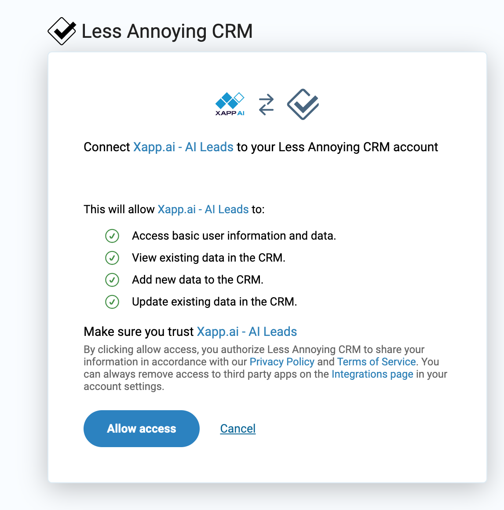
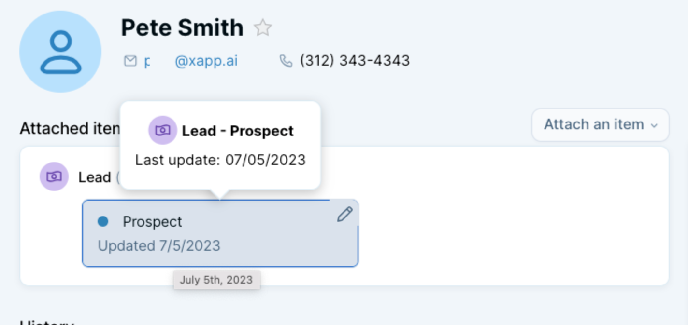
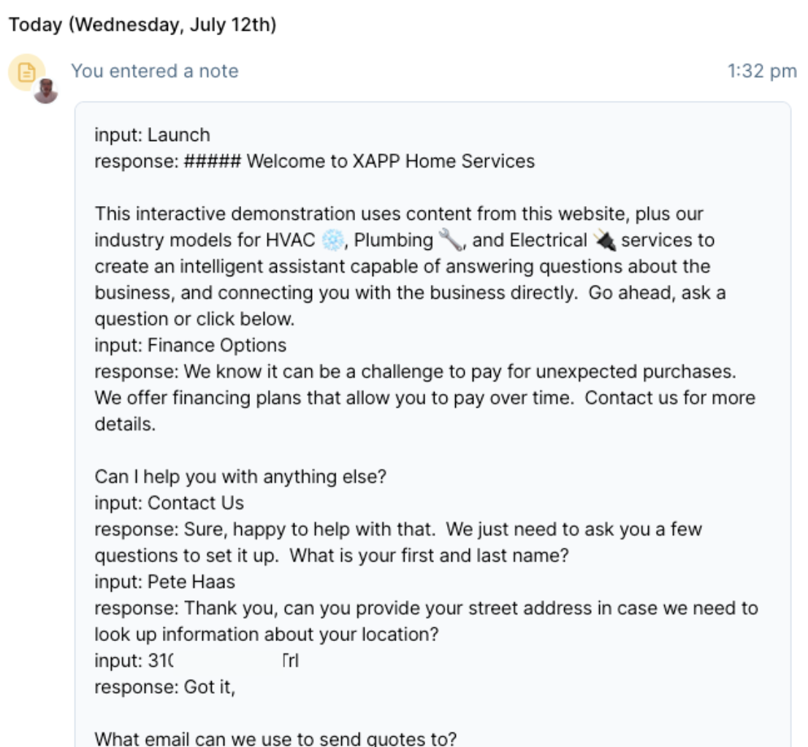

You can connect your existing Less Annoying CRM instance with AI Powered Chat, and Google Business Messages.

- Send leads to your Less Annoying CRM instance
- Collect name and contact information
- Naturally transition the conversation to a lead flow
- Receive the full transcript of the conversation
- Get notified when users are talking to you, and speak directly

---

### Connect your account

Allow XAPP AI access to your instance, we'll send captured leads to your account

### Install Chat (and Search) onto your website

- [Wordpress Plugin Installs Chat & Search](/help/install/wordpress)
- [Install Chat Manually](/help/install/javascript)
- [Install Search Manually](/help/channels/intelligent-search)

### Detect that the user wants to connect with the business

We provide helpful suggestion chips users can click to initiate a lead flow. This can be a simple 'Contact Us' button like above.

Also provided are pre-built language models to determine a user's desire to connect with the business. When this happens, the user is put into a lead flow. In the image above, our auto-complete suggestions for a home services company lets the user discover the phrases they can use.

### Lead information sent to Less Annoying CRM

When a lead is captured during a chat or Google Business Messages session, XAPP AI sends the following information:

- Contact - If this is a new lead, it will be added. When we find a match on the contact information like the email address, we don't create a new lead. Instead, we update the contact with the transcipt of the conversation that led to the lead being capture. The transcript will be attached as a note.
- Lead Pipeline - Your lead will be automatically added to the default pipeline as a 'Prospect'. You can update the status of the contact as your relationship changes.

  

