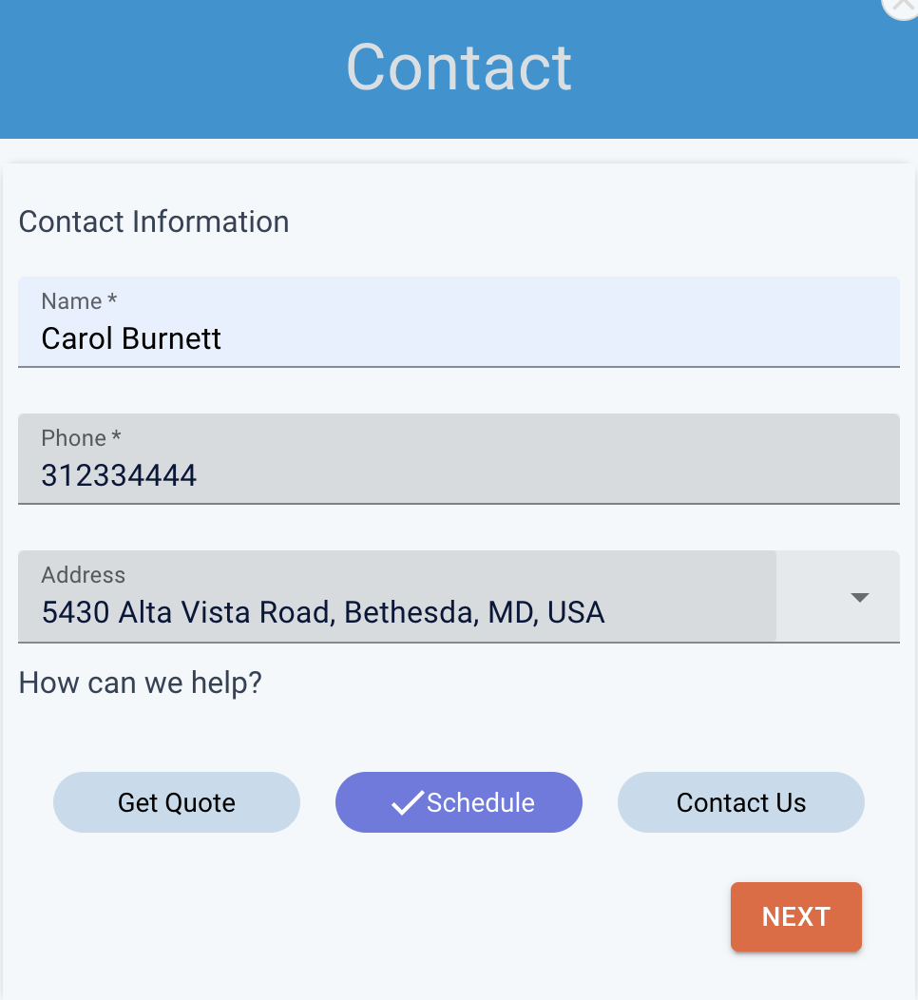

:::important

3rd party integrations are available starting at the Leads+ tier

:::

You can connect your existing Service Titan account with AI Powered Chat, and Google Business Messages.

- Send bookings & jobs to your Service Titan account
- Collect name and contact information
- Naturally transition the conversation to a lead flow
- Receive the full transcript of the conversation
- Get notified when users are talking to you, and speak directly

---

## Connect your Service Titan account to XAPP AI

### Step 1

#### Provide your tenant id from your Service Titan account

- You can find this by going to 'Integrations -> API Application Access' from your account.
- Enter this value when XAPP AI prompts for it

### Step 2

#### Connect to XAPP AI

**Warning:** _XAPP must add your Tenant ID before you can complete this step. You will receive a notification when you can complete step 2_

- From the same page on your Service Titan account, click the **Connect New App** button app

- Select the app, choose **AI for Home Services by XAPP AI**

- Allow Access to connect your account

### Step 3

#### Add a Booking provider

- Adding a provider will allow you to see where your booking are coming from
- If you haven't done this, add it by clicking 'Add new provider' and repeating Step 2 when you've add it. Your new booking provider will show in the drop-down when selecting. \_ make note of the ID associated with the booking, you'll need it later

# AI Scheduling

:::important

Scheduling is only available on the XAPP AI Scheduling plan.

:::

## How it works

We will ask for the contact information of the user and then ask them to describe the issue they have. We will then leverage AI to appropriately match what the potential customer as requested to the correct job type within ServiceTitan.

#### Scheduling user requests in 3 steps!

1. Collect Contact info

2. Describe your issue 

3. Select your preferred day 

4. Done!

  

   
  

# View Bookings as Leads on your account

- To Trigger a lead, type **Contact Us** in your Chat or Google Business Message app. You'll be prompted for your contact information.
- In your Service Titan account, leads will be sent to **Calls->Booking** in your account
- View each lead, and accept or dismiss

